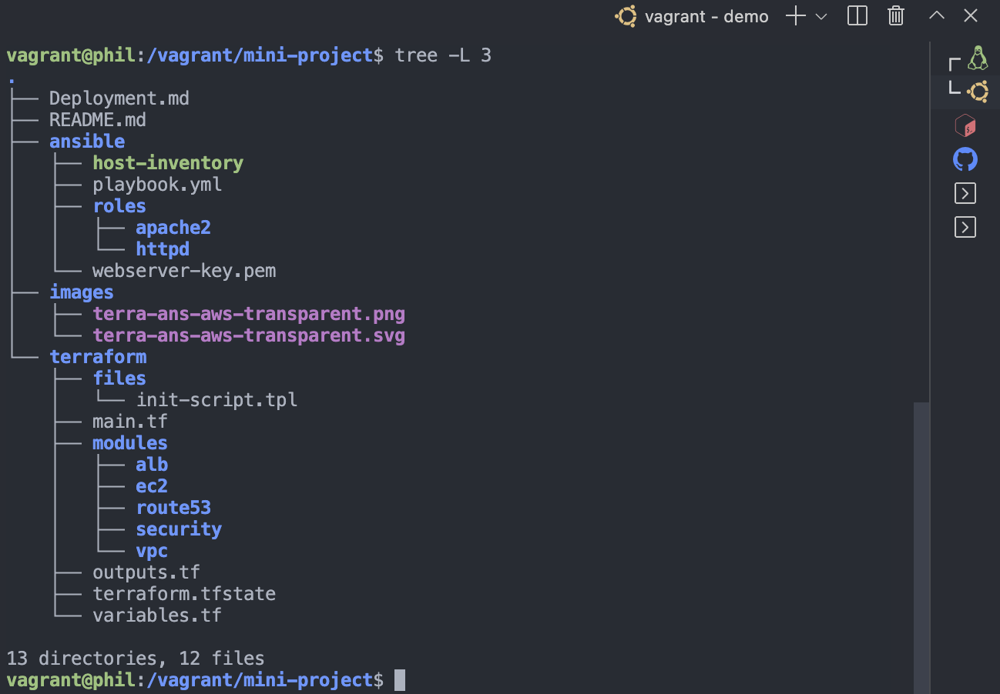
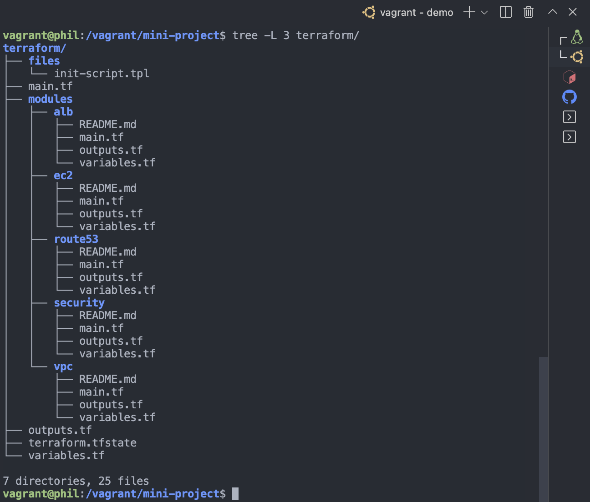
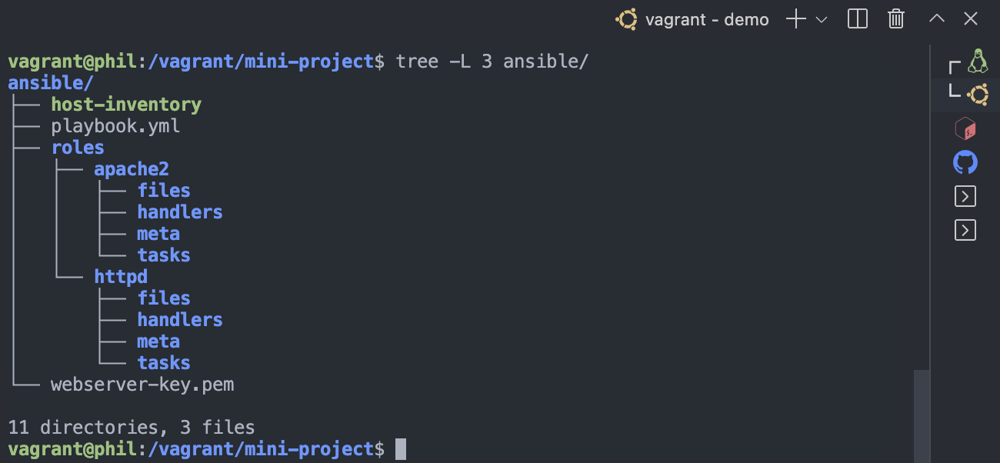

In this article, I will show you how to provision and a stateless web application using Terraform and Ansible

 Terraform's configuration language is declarative, meaning that it describes the desired end-state for your infrastructure, in contrast to procedural programming languages that require step-by-step instructions to perform tasks. Terraform providers automatically calculate dependencies between resources to create or destroy them in the correct order.

To deploy this project, you'll need:
  * The Terraform CLI installed
  * Ansible CLI installed
  * The AWS CLI installed (optional)
  * Git installed
  * AWS account and associated credentials that allow you to create resources
  * A key pair on AWS (optional)
  * An SSL public certificate on AWS (optional)

 Note: I am also assuming you have basic to intermediate knowledge of AWS, Terraform and Ansible.

To use your IAM credentials to authenticate the Terraform AWS provider, set the `AWS_ACCESS_KEY_ID` and secret key environment variables by running the following commands, we'll be using this later.

```php
export AWS_ACCESS_KEY_ID="insert your AWS ACCESS KEY here"
```

```ruby
export AWS_SECRET_ACCESS_KEY="insert your AWS SECRET KEY here"
```

Tip: <span> If you don't have access to IAM user credentials, use another authentication method described in the AWS provider documentation.</span>

Warning: This tutorial will only provision resources that qualify under the <bold>AWS free tier<bold>. While following it please be sure that your AWS account qualifies for free tier resources, as I'll not responsible for any charges that you may incur.

###### Note: 
  This project deploys automatically to the `us-east-1` region you can change this to whatever region is closer to you inorder to avoid latency issues.


## Best Practices
Before we get into laying out project structure, let’s talk about some of the basic Terraform development best practices first, so we can have a solid starting point.

## Project structure

First of all, don’t put everything in one file, you need to have a project folder structure for code reusability, code sharing, code maintenance, and code clarity. A typical Terraform folder structure will look like the following. Terraform has also made things easy for us by providing what we call Terraform modules, modules are basically reusable pieces of code just like functions or libraries.

By the end of this project, our terraform directory would look like the image below


 Note: All files in your Terraform directory using the .tf file format will be automatically loaded during operations.

## Use variables!!!

Don’t hard code everything, even though you can totally do that, but it is recommended to define and store variables in a file called variables.tf . In my example, I have the following variables in my variables.tf 

Sample Variable

```ruby
variable "aws_region" {
  description = "region to deploy all aws project resources"
  type        = string
  default     = "us-east-1"
}
```

### TO Deploy this project 


Clone this repo

```php
git clone https://github.com/philemonnwanne/altschool-cloud-exercises.git
```


cd into the terraform directory and run 

```php
terraform init
```
Note: A hidden folder called `.terraform` will be generated, it contains all the installed plugins and modules for your platform.

To reformat your code run 

```ruby
terraform fmt
```  

To run some basic validations do

```ruby
terraform validate
```

To know what changes terraform will make to your infrastructure run
```php
terraform plan
```

Note: This is a very convenient way to check whether the execution plan for a set of changes matches your expectations without making any changes to real resources or to the state.

Deploy terraform configuration
Now we are ready to deploy! Simply run 

```php
terraform apply -auto-approve
```

Note: Don't forget to run `terraform destroy` when you're done to clean up
</br>
</br>


## Terraform Directory Structure




## Ansible Directory Structure

